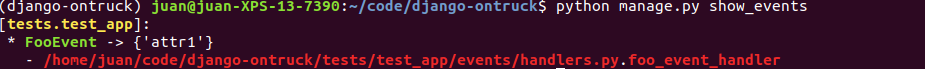

============
Features
============

*********
Use cases
*********

Use case layer is in charge of handle business logic.

- Manages transaction
- Manages executions dependent of committed transaction
- Returns data to caller (i.e for API responses purposes)
- Hides complexity
- Allows nesting to DRY
- Establishes events as the only way to propagate on_commit execution

.. code-block:: python

    from django_ontruck.use_cases import UseCaseBase
    from .events import FooEvent
    from .models import FooModel

    class FooUseCase(UseCaseBase):

    def execute_in_commit(self, command, executed_by=None):
        example = FooModel.objects.create(**command)
        self.events.append(FooEvent(attr1='attr1_value'))
        return example

Events created will be published when outermost transaction is committed

*********
Events
*********

Abstraction to decouple contexts wrapping django signals

.. code-block:: python

    from django.dispatch import Signal
    from django_ontruck.events import EventBase

    class FooEvent(EventBase):
        signal = Signal(['attr1'])

Check `show_events` command to `List all events`_.

.. code-block:: shell

    python manage.py show_events

*********
Queries
*********

Analogue to CQRS, a separation between the logic that writes (use cases) from the one that reads (queries).

.. code-block:: python

    class CountFooQuery(QueryBase):

        def execute(self, command, executed_by=None):
            text = command.get('title')
            return {'count': FooModel.objects.filter(title__contains=text).count()}

*********
Models
*********

Base model to track some CRUD dates and author. Safe delete is implemented.

.. code-block:: python

    from django.db import models
    from django_ontruck.models import BaseModel

    class FooModel(BaseModel):
        title = models.CharField(max_length=50)

*********
Notifiers
*********

Base classes to notify events to 3rd party systems like Slack, Segment, etc.

.. code-block:: python

    from django.db import models
    from django_ontruck.notifiers.segment import SegmentNotifier
    from django_ontruck.notifiers import AsyncNotifier

    class FooNotifier(segmentNotifier):
        async_class = AsyncNotifier
        event_id = 'test_event'

*********
Views
*********

Collections of DRF views extended to fit with BaseModel and UseCases

*********
Testing
*********

Utils for testing.

Patch transactions and run transaction.on_commit
-------------------------------------------

After last transaction inside test is exit

Create a fixture

.. code-block:: python

    @pytest.fixture(autouse=True)
    def _run_on_commit_callbacks(request):
        marker = request.node.get_closest_marker("run_on_commit_callbacks")

        if marker:
            with PatchedAtomic():
                yield
        else:
            yield

Mark your tests you want to use it

.. code-block:: python

        @mark.run_on_commit_callbacks
        def test_use_case_post_commit(self, mocker, foo_use_case):
            mock_event_send = mocker.patch('django_ontruck.events.EventBase.send')
            foo_use_case.execute({})
            mock_event_send.assert_called_once()

*********
Commands
*********

List all events
-----------------

Show all events defined in each app and handlers connected.

.. code-block:: shell

    python manage.py show_events

App template
-------------

Start app with directory/files structure.

.. code-block:: python

    python manage.py startontruckapp appname
